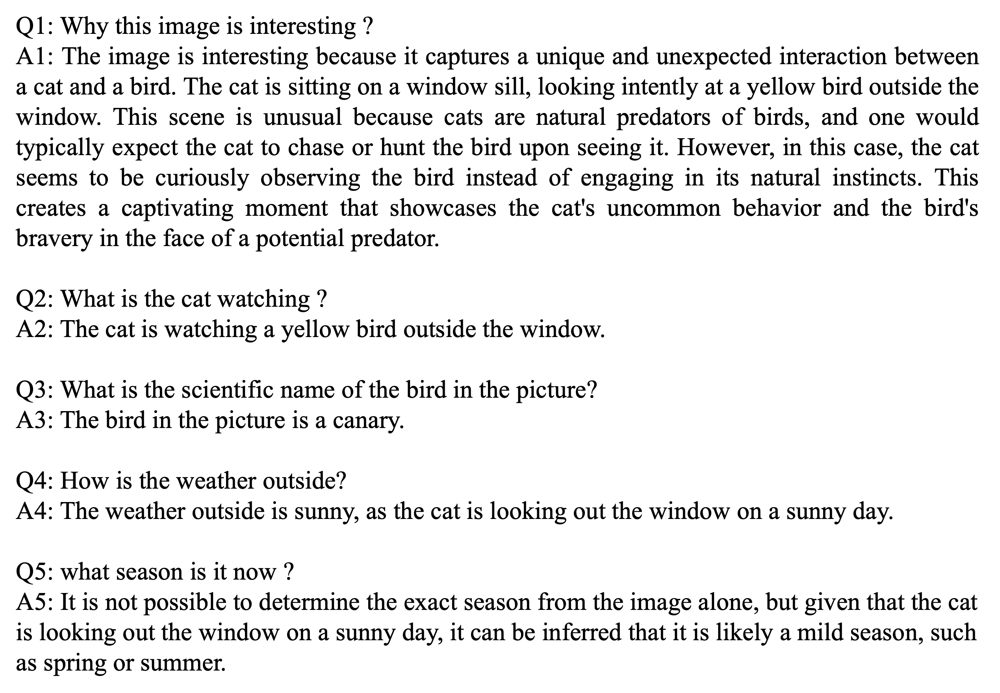

## [InfMLLM: A Unified Model for Visual-Language Tasks](https://arxiv.org/abs/2311.06791)

<a href='https://arxiv.org/abs/2311.06791'></a>

<p align="center">

</p>


## Release
- [12/06] Make the models and evaluation code available; the manuscript v2 will be posted on ArXiv in two days.
- [11/06] Upload the initial version of the manuscript to arXiv.


## Contents
- [Install](#install)
- [Model Zoo](#model-zoo)
- [Evaluation](#evaluation)
- [Demo](#demo)


## Install
```
conda create -n infmllm python=3.9
conda activate infmllm
conda install pytorch==2.1.0 torchvision==0.16.0 torchaudio==2.1.0 pytorch-cuda=12.1 -c pytorch -c nvidia
pip install -r requirements.txt -i https://pypi.tuna.tsinghua.edu.cn/simple
```


## Model Zoo
Both the multitask and instruction tuning models are now available on Hugging Face!

- [InfMLLM-7B](https://huggingface.co/mightyzau/InfMLLM_7B)
- [InfMLLM-7B-Chat](https://huggingface.co/mightyzau/InfMLLM_7B_Chat)
- [InfMLLM-13B-Chat](https://huggingface.co/mightyzau/inf-mllm-13b-chat)


## Evaluation

We conducted evaluations of the **InfMLLM-7B** multitask model across five VQA (Visual Question Answering) datasets and three visual grounding datasets. Meanwhile, the **InfMLLM-7B-Chat** model, tuned for instruction-following, was assessed on four VQA datasets and six multi-modal benchmarks. For detailed evaluation procedures, please refer to [Evaluation](docs/Evaluation.md).

<p align="center">

</p>

<p align="center">

</p>

## Demo
Trying **InfMLLM-7B-Chat** is straightforward. We've provided a [demo script](demo.py) to run on the following example image.

<p align="center">

</p>

```
CUDA_VISIBLE_DEVICES=0 python demo.py
```

The conversation generated is shown below.

<p align="center">

</p>


## Citation

```
@misc{zhou2023infmllm,
      title={InfMLLM: A Unified Framework for Visual-Language Tasks}, 
      author={Qiang Zhou and Zhibin Wang and Wei Chu and Yinghui Xu and Hao Li and Yuan Qi},
      year={2023},
      eprint={2311.06791},
      archivePrefix={arXiv},
      primaryClass={cs.CV}
}
```

## Acknowledgments
This work wouldn't be possible without the incredible open-source code of these projects. Huge thanks!

 - [BLIP2](https://github.com/salesforce/LAVIS)
 - [Qwen-VL](https://github.com/QwenLM/Qwen-VL)
 - [LLaVA](https://github.com/haotian-liu/LLaVA)
