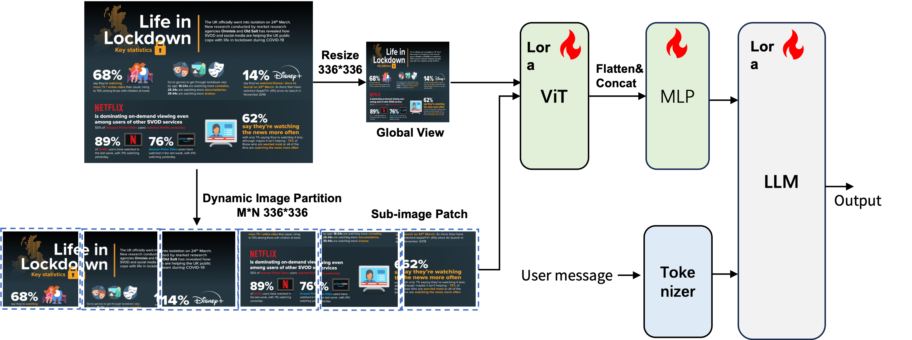
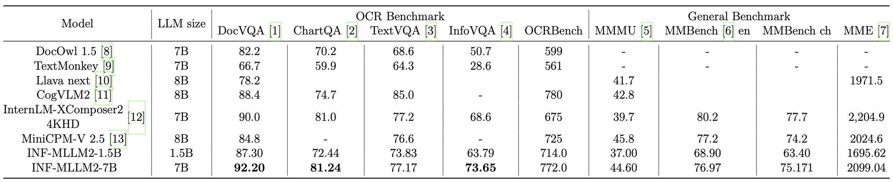
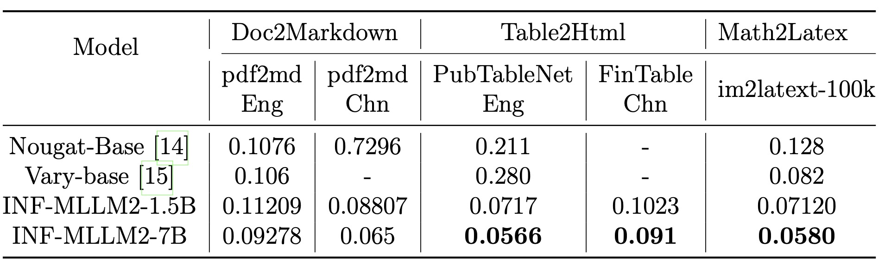
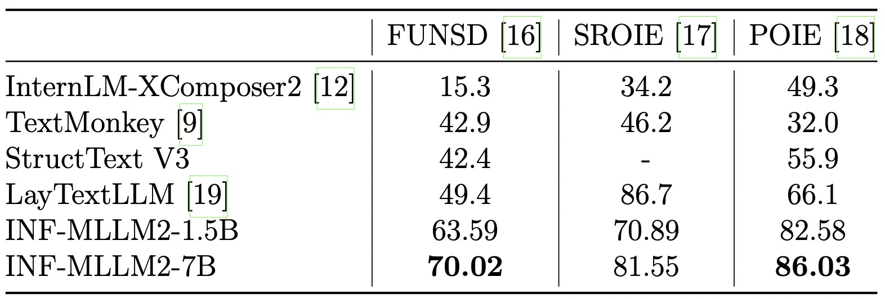
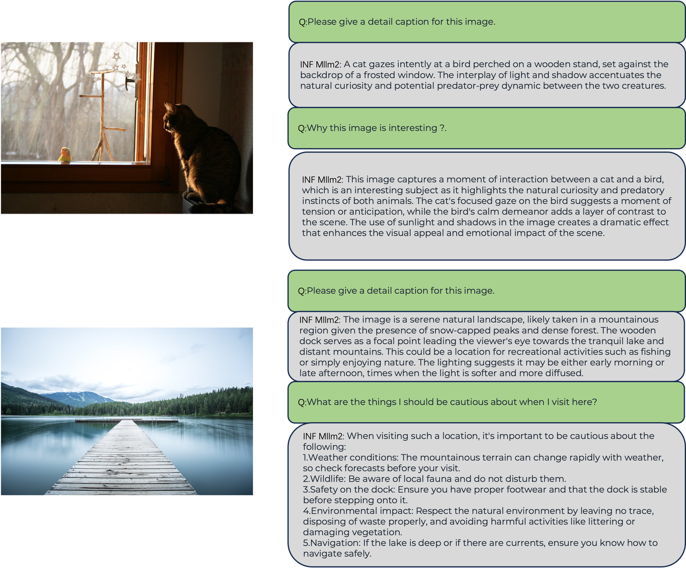
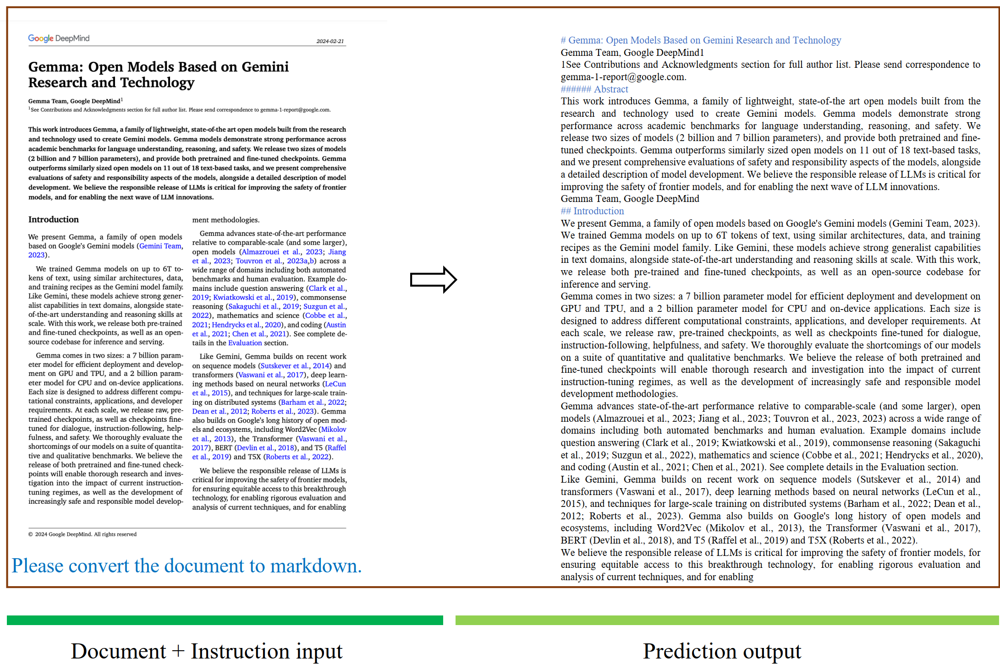
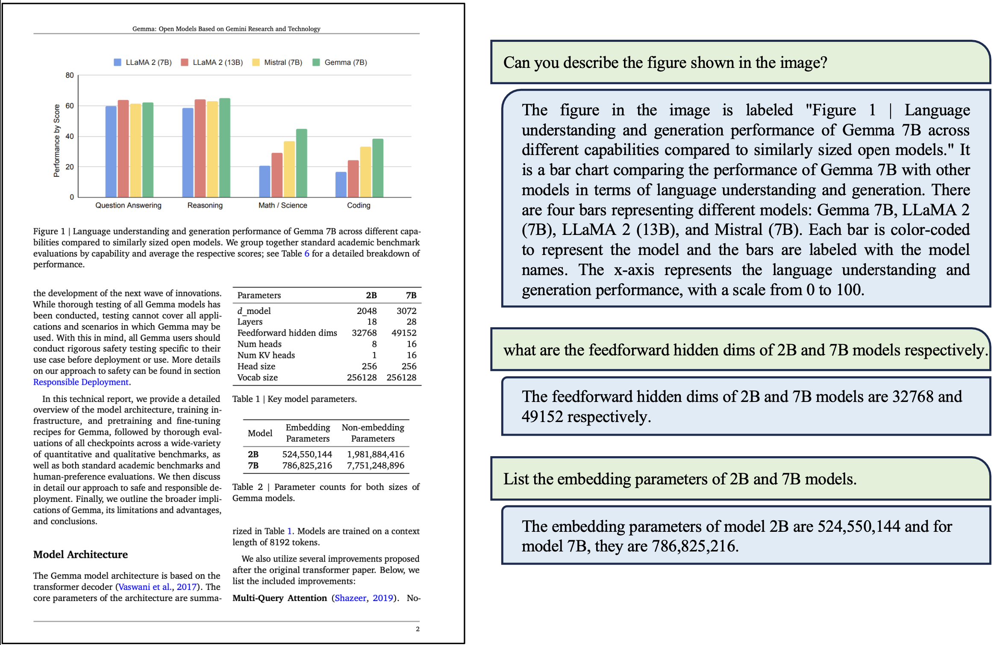
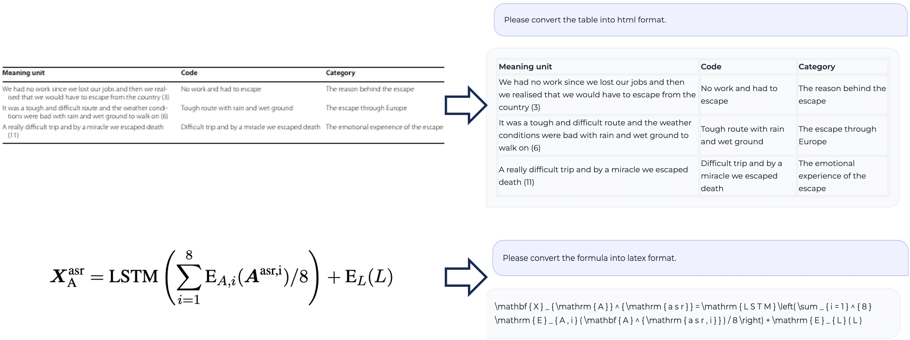

## INF-MLLM2: High-Resolution Image and Document Understanding

In INF-MLLM2, we have introduced significant updates, particularly in high-resolution image processing, document understanding and OCR.
The key improvements include the following:
• Dynamic Image Resolution Support: The model now supports dynamic image resolution up to 1344x1344 pixels.
• Enhanced OCR Capabilities: The model has significantly improved OCR capabilities, enabling robust document parsing, table and formula recognition, document layout analysis, and key information extraction.
• Advanced Training Strategies: We employed a progressive multi-stage training strategy along with an enhanced data mixup strategy tailored for image and document multitask scenarios.

<p align="center">

</p>

[Technical Report](docs/tech_report.pdf)

### Install

```bash
conda create -n infmllm2 python=3.9
conda activate infmllm2
conda install pytorch==2.2.1 torchvision==0.17.1 torchaudio==2.1.2

pip install transformers==4.40.2 timm==0.5.4 pillow==10.4.0 sentencepiece==0.1.99
pip install bigmodelvis peft einops spacy
```

### Model Zoo
We have released the INF-MLLM2-7B model on Hugging Face.
- [INF-MLLM2-7B](https://huggingface.co/QianYEee/InfMLLM2_7B_chat)

### Evaluation
The comparison with general multimodal LLM across multiple benchmarks and OCR-related tasks.
<p align="center">

</p>

The comparison with OCR-free multimodal LLM for content parsing of documents/tables/formulas.
<p align="center">

</p>

The comparison with OCR-free multimodal LLM for key information extraction.
<p align="center">

</p>

### Visualization

<p align="center">

</p>

<p align="center">

</p>

<p align="center">

</p>

<p align="center">

</p>

### Usage

The inference process for INF-MLLM2 is straightforward. We also provide a simple [demo.py](demo.py) script as a reference.

```bash
CUDA_VISIBLE_DEVICES=0 python demo.py --model_path /path/to/InfMLLM2_7B_chat
```
