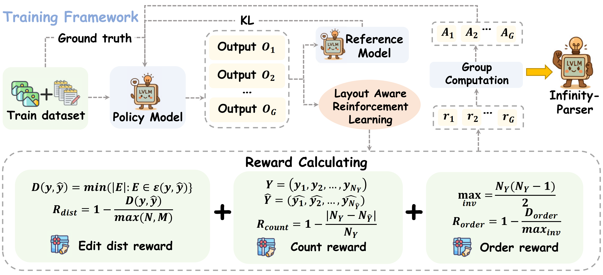
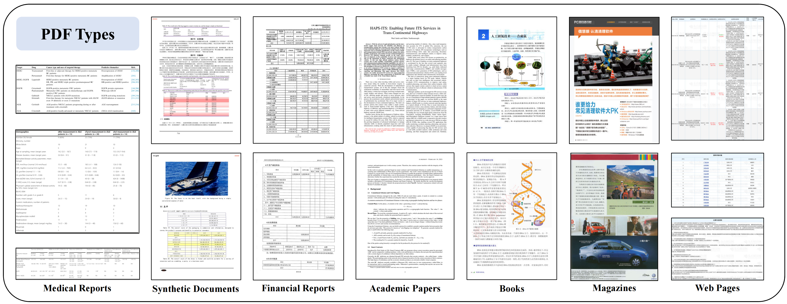

# Infinity-Parser: Layout-Aware Reinforcement Learning for Scanned Document Parsing

  <a><b> Paper (coming soon) </b></a> | 
  <a href="https://huggingface.co/datasets/infly/Infinity-Doc-55K"><b> Dataset </b></a> | 
  <a>💬<b> Web Demo (coming soon) </b></a>

## Introduction

We develop Infinity-Parser, an end-to-end scanned document parsing model trained with reinforcement learning. By incorporating verifiable rewards based on layout and content, Infinity-Parser maintains the original document's structure and content with high fidelity. It demonstrates state-of-the-art (SOTA) performance across diverse English and Chinese benchmarks for OCR, table and formula extraction, and reading-order detection, such as  OmnidocBench. Its performance surpasses existing open-source VLMs and even closed-source models such as GPT-4o. Additionally, we constructe the Infinity-Doc-55k high-quality full-text parsing dataset, comprising 55,066 real-world and synthetic scanned documents. This dataset covers fi cial reports, medical reports, academic reports, books, magazines, web pages, and synthetic documents.

## Architecture

Overview of Infinity-Parser training framework. Our model is optimized via reinforcement finetuning with
edit distance, layout, and order-based rewards.

## Dataset
Comparison between Infinity-Doc-55K and existing data:

<!DOCTYPE html>
<html>
<head>
    <meta charset="utf-8">
    
</head>
<body>
<table border="1" class="dataframe dataframe">
    <tr style="text-align: center;">
      <th rowspan="2">Benchmark</th>
      <th rowspan="2">Document Domain</th>
      <th colspan="5">Annotation Type</th>
      <th colspan="4">End-to-End Task</th>
      <th rowspan="2">Exactly Match</th>
    </tr>
    <tr>
      <td>BBox</td>
      <td>Text</td>
      <td>Table</td>
      <td>Formula</td>
      <td>Attributes</td>
      <td>OCR</td>
      <td>TR</td>
      <td>MFR</td>
      <td>ROD</td>
    </tr>
    <tr>
      <td colspan="12">End-to-end Eval Benchmarks</td>
    </tr>
    <tr>
      <td>Fox</td>
      <td>2</td>
      <td>✓</td>
      <td>✓</td>
      <td> </td>
      <td> </td>
      <td> </td>
      <td>✓</td>
      <td> </td>
      <td> </td>
      <td> </td>
      <td> </td>
    </tr>
    <tr>
      <td>Nougat</td>
      <td>1</td>
      <td> </td>
      <td>✓</td>
      <td>✓</td>
      <td>✓</td>
      <td> </td>
      <td>✓</td>
      <td>✓</td>
      <td>✓</td>
      <td> </td>
      <td> </td>
    </tr>
    <tr>
      <td>GOT OCR 2.0</td>
      <td>2</td>
      <td> </td>
      <td>✓</td>
      <td>✓</td>
      <td>✓</td>
      <td> </td>
      <td>✓</td>
      <td>✓</td>
      <td>✓</td>
      <td> </td>
      <td>✓</td>
    </tr>
    <tr>
      <td>OmniDocBench</td>
      <td>9</td>
      <td>✓</td>
      <td>✓</td>
      <td>✓</td>
      <td>✓</td>
      <td>✓</td>
      <td>✓</td>
      <td>✓</td>
      <td>✓</td>
      <td>✓</td>
      <td>✓</td>
    </tr>
    <tr>
      <td colspan="12">End-to-end Train Dataset</td>
    </tr>
    <tr>
      <td>DocStruct4M</td>
      <td>-</td>
      <td> </td>
      <td>✓</td>
      <td> </td>
      <td> </td>
      <td> </td>
      <td>✓</td>
      <td> </td>
      <td> </td>
      <td> </td>
      <td> </td>
    </tr>
    <tr>
      <td>olmoOCR-mix</td>
      <td>-</td>
      <td> </td>
      <td>✓</td>
      <td>✓</td>
      <td>✓</td>
      <td> </td>
      <td>✓</td>
      <td>✓</td>
      <td>✓</td>
      <td>✓</td>
      <td> </td>
    </tr>
    <tr>
      <td>Infinity-Doc-55K</td>
      <td>7</td>
      <td>✓</td>
      <td>✓</td>
      <td>✓</td>
      <td>✓</td>
      <td>✓</td>
      <td>✓</td>
      <td>✓</td>
      <td>✓</td>
      <td>✓</td>
      <td>✓</td>
    </tr>
</table>
</body>
</html>

This figure illustrates a diverse collection of PDF document types commonly encountered in Infinity-Doc-55K, grouped into seven categories: Medical Reports, Synthetic Documents, Fi cial Reports, Academic Papers, Books, Magazines, and Web Pages.

# Performance

Comprehensive evaluation of document parsing algorithms on OmniDocBench:

<!DOCTYPE html>
<html>
<head>
    <meta charset="utf-8">
    
</head>
<body>
<table>
    <tr style="text-align: right;">
      <th rowspan="2">Methods</th>
      <th colspan="2">TextEdit↓</th>
      <th colspan="2">Form.Edit↓</th>
      <th colspan="2">Form.CDM</th>
      <th colspan="2">TableTEDS</th>
      <th colspan="2">TableEdit↓</th>
      <th colspan="2">Read OrderEdit↓</th>
      <th colspan="2">OverallEdit↓</th>
    </tr>
    <tr>
      <td>EN</td>
      <td>ZH</td>
      <td>EN</td>
      <td>ZH</td>
      <td>EN</td>
      <td>ZH</td>
      <td>EN</td>
      <td>ZH</td>
      <td>EN</td>
      <td>ZH</td>
      <td>EN</td>
      <td>ZH</td>
      <td>EN</td>
      <td>ZH</td>
    </tr>
    <tr>
      <td colspan="15">Based on Pipeline Tools</td>
    </tr>
    <tr>
      <td>MinerU</td>
      <td><b>0.061</b></td>
      <td>0.215</td>
      <td><b>0.278</b></td>
      <td>0.577</td>
      <td>57.3</td>
      <td>42.9</td>
      <td>78.6</td>
      <td>62.1</td>
      <td>0.18</td>
      <td>0.344</td>
      <td><b>0.079</b></td>
      <td>0.292</td>
      <td><b>0.15</b></td>
      <td>0.357</td>
    </tr>
    <tr>
      <td>Marker</td>
      <td>0.08</td>
      <td>0.315</td>
      <td>0.53</td>
      <td>0.883</td>
      <td>17.6</td>
      <td>11.7</td>
      <td>67.6</td>
      <td>49.2</td>
      <td>0.619</td>
      <td>0.685</td>
      <td>0.114</td>
      <td>0.34</td>
      <td>0.336</td>
      <td>0.556</td>
    </tr>
    <tr>
      <td>Mathpix</td>
      <td>0.105</td>
      <td>0.384</td>
      <td>0.306</td>
      <td><b>0.454</b></td>
      <td>62.7</td>
      <td>62.1</td>
      <td>77</td>
      <td>67.1</td>
      <td>0.243</td>
      <td>0.32</td>
      <td>0.108</td>
      <td>0.304</td>
      <td>0.191</td>
      <td>0.365</td>
    </tr>
    <tr>
      <td>Docling</td>
      <td>0.416</td>
      <td>0.987</td>
      <td>0.999</td>
      <td>1</td>
      <td>-</td>
      <td>-</td>
      <td>61.3</td>
      <td>25</td>
      <td>0.627</td>
      <td>0.81</td>
      <td>0.313</td>
      <td>0.837</td>
      <td>0.589</td>
      <td>0.909</td>
    </tr>
    <tr>
      <td>Pix2Text</td>
      <td>0.138</td>
      <td>0.356</td>
      <td>0.276</td>
      <td>0.611</td>
      <td>78.4</td>
      <td>39.6</td>
      <td>73.6</td>
      <td>66.2</td>
      <td>0.584</td>
      <td>0.645</td>
      <td>0.281</td>
      <td>0.499</td>
      <td>0.32</td>
      <td>0.528</td>
    </tr>
    <tr>
      <td>Unstructured-0.17.2</td>
      <td>0.198</td>
      <td>0.481</td>
      <td>0.999</td>
      <td>1</td>
      <td>-</td>
      <td>-</td>
      <td>-</td>
      <td>-</td>
      <td>1</td>
      <td>0.998</td>
      <td>0.145</td>
      <td>0.387</td>
      <td>0.586</td>
      <td>0.716</td>
    </tr>
    <tr>
      <td>OpenParse-0.7.0</td>
      <td>0.681</td>
      <td>0.974</td>
      <td>0.996</td>
      <td>1</td>
      <td>-</td>
      <td>-</td>
      <td>64.8</td>
      <td>27.5</td>
      <td>0.284</td>
      <td>0.639</td>
      <td>0.595</td>
      <td>0.641</td>
      <td>0.646</td>
      <td>0.814</td>
    </tr>
    <tr>
      <td colspan="15">Based on Expert VLMs</td>
    </tr>
    <tr>
      <td>GOT-OCR</td>
      <td>0.189</td>
      <td>0.315</td>
      <td>0.36</td>
      <td>0.528</td>
      <td>74.3</td>
      <td>45.3</td>
      <td>53.2</td>
      <td>47.2</td>
      <td>0.459</td>
      <td>0.52</td>
      <td>0.141</td>
      <td>0.28</td>
      <td>0.287</td>
      <td>0.411</td>
    </tr>
    <tr>
      <td>Nougat</td>
      <td>0.365</td>
      <td>0.998</td>
      <td>0.488</td>
      <td>0.941</td>
      <td>15.1</td>
      <td>16.8</td>
      <td>39.9</td>
      <td>0</td>
      <td>0.572</td>
      <td>1</td>
      <td>0.382</td>
      <td>0.954</td>
      <td>0.452</td>
      <td>0.973</td>
    </tr>
    <tr>
      <td>Mistral OCR</td>
      <td>0.072</td>
      <td>0.325</td>
      <td>0.318</td>
      <td>0.495</td>
      <td>64.6</td>
      <td>45.9</td>
      <td>75.8</td>
      <td>63.6</td>
      <td>0.6</td>
      <td>0.65</td>
      <td>0.083</td>
      <td>0.284</td>
      <td>0.268</td>
      <td>0.439</td>
    </tr>
    <tr>
      <td>OLMoCR-sglang</td>
      <td>0.097</td>
      <td>0.293</td>
      <td>0.455</td>
      <td>0.655</td>
      <td>74.3</td>
      <td>43.2</td>
      <td>68.1</td>
      <td>61.3</td>
      <td>0.608</td>
      <td>0.652</td>
      <td>0.145</td>
      <td>0.277</td>
      <td>0.326</td>
      <td>0.469</td>
    </tr>
    <tr>
      <td>SmolDocling-256M</td>
      <td>0.262</td>
      <td>0.838</td>
      <td>0.753</td>
      <td>0.997</td>
      <td>32.1</td>
      <td>55.1</td>
      <td>44.9</td>
      <td>16.5</td>
      <td>0.729</td>
      <td>0.907</td>
      <td>0.227</td>
      <td>0.522</td>
      <td>0.493</td>
      <td>0.816</td>
    </tr>
    <tr>
      <td colspan="15">Based on General VLMs</td>
    </tr>
    <tr>
      <td>GPT-4o</td>
      <td>0.144</td>
      <td>0.409</td>
      <td>0.425</td>
      <td>0.606</td>
      <td>72.8</td>
      <td>42.8</td>
      <td>72</td>
      <td>62.9</td>
      <td>0.234</td>
      <td>0.329</td>
      <td>0.128</td>
      <td>0.251</td>
      <td>0.233</td>
      <td>0.399</td>
    </tr>
    <tr>
      <td>Qwen2-VL-72B</td>
      <td>0.096</td>
      <td>0.218</td>
      <td>0.404</td>
      <td>0.487</td>
      <td><b>82.2</b></td>
      <td>61.2</td>
      <td>76.8</td>
      <td>76.4</td>
      <td>0.387</td>
      <td>0.408</td>
      <td>0.119</td>
      <td>0.193</td>
      <td>0.252</td>
      <td>0.327</td>
    </tr>
    <tr>
      <td>InternVL2-76B</td>
      <td>0.353</td>
      <td>0.29</td>
      <td>0.543</td>
      <td>0.701</td>
      <td>67.4</td>
      <td>44.1</td>
      <td>63</td>
      <td>60.2</td>
      <td>0.547</td>
      <td>0.555</td>
      <td>0.317</td>
      <td>0.228</td>
      <td>0.44</td>
      <td>0.443</td>
    </tr>
    <tr>
      <td>Qwen2.5-VL-7B</td>
      <td>0.222</td>
      <td>0.236</td>
      <td>0.394</td>
      <td>0.587</td>
      <td>68.4</td>
      <td>45.1</td>
      <td>71.5</td>
      <td>75.7</td>
      <td>0.465</td>
      <td>0.294</td>
      <td>0.246</td>
      <td>0.207</td>
      <td>0.332</td>
      <td>0.331</td>
    </tr>
    <tr>
      <td>InternVL3-8B</td>
      <td>0.315</td>
      <td>0.345</td>
      <td>0.714</td>
      <td>0.729</td>
      <td>59.4</td>
      <td><b>72.3</b></td>
      <td>59</td>
      <td>71.5</td>
      <td>0.352</td>
      <td>0.211</td>
      <td>0.324</td>
      <td>0.257</td>
      <td>0.426</td>
      <td>0.385</td>
    </tr>
    <tr>
      <td colspan="15">Based on Reinforcement Learning</td>
    </tr>
    <tr>
      <td>Infinity-Parser-7B</td>
      <td>0.093</td>
      <td><b>0.156</b></td>
      <td>0.363</td>
      <td>0.822</td>
      <td>70.5</td>
      <td>43.5</td>
      <td><b>81.6</b></td>
      <td><b>79.0</b></td>
      <td><b>0.142</b></td>
      <td><b>0.156</b></td>
      <td>0.126</td>
      <td><b>0.162</b></td>
      <td>0.181</td>
      <td><b>0.324</b></td>
    </tr>
</table>
</body>
</html>

Performance comparison of dense English and Chinese OCR on document-level pages:

<!DOCTYPE html>
<html>
<head>
    <meta charset="utf-8">
    
</head>
<body>
<table>
  <thead>
    <tr style="text-align: right;">
      <th rowspan="2">Method</th>
      <th rowspan="2">Size</th>
      <th colspan="2">F1-score↑</th>
      <th colspan="2">Precision↑</th>
      <th colspan="2">Recall↑</th>
      <th colspan="2">BLEU↑</th>
      <th colspan="2">METEOR↑</th>
      <th colspan="2">Edit Distance↓</th>
    </tr>
    <tr>
      <td>EN</td>
      <td>ZH</td>
      <td>EN</td>
      <td>ZH</td>
      <td>EN</td>
      <td>ZH</td>
      <td>EN</td>
      <td>ZH</td>
      <td>EN</td>
      <td>ZH</td>
      <td>EN</td>
      <td>ZH</td>
    </tr>
    <tr>
      <td>UReader</td>
      <td>7B</td>
      <td>0.344</td>
      <td>-</td>
      <td>0.296</td>
      <td>-</td>
      <td>0.469</td>
      <td>-</td>
      <td>0.103</td>
      <td>-</td>
      <td>0.287</td>
      <td>-</td>
      <td>0.718</td>
      <td>-</td>
    </tr>
    <tr>
      <td>LLaVA-NeXT</td>
      <td>34B</td>
      <td>0.647</td>
      <td>-</td>
      <td>0.573</td>
      <td>-</td>
      <td>0.881</td>
      <td>-</td>
      <td>0.478</td>
      <td>-</td>
      <td>0.582</td>
      <td>-</td>
      <td>0.43</td>
      <td>-</td>
    </tr>
    <tr>
      <td>InternVL-ChatV1.5</td>
      <td>26B</td>
      <td>0.751</td>
      <td>0.816</td>
      <td>0.698</td>
      <td>0.784</td>
      <td>0.917</td>
      <td>0.866</td>
      <td>0.568</td>
      <td>0.622</td>
      <td>0.663</td>
      <td>0.717</td>
      <td>0.393</td>
      <td>0.265</td>
    </tr>
    <tr>
      <td>Nougat</td>
      <td>250M</td>
      <td>0.745</td>
      <td>-</td>
      <td>0.72</td>
      <td>-</td>
      <td>0.809</td>
      <td>-</td>
      <td>0.665</td>
      <td>-</td>
      <td>0.761</td>
      <td>-</td>
      <td>0.255</td>
      <td>-</td>
    </tr>
    <tr>
      <td>TextMonkey</td>
      <td>7B</td>
      <td>0.821</td>
      <td>-</td>
      <td>0.778</td>
      <td>-</td>
      <td>0.906</td>
      <td>-</td>
      <td>0.671</td>
      <td>-</td>
      <td>0.762</td>
      <td>-</td>
      <td>0.265</td>
      <td>-</td>
    </tr>
    <tr>
      <td>DocOwl1.5</td>
      <td>7B</td>
      <td>0.862</td>
      <td>-</td>
      <td>0.835</td>
      <td>-</td>
      <td>0.962</td>
      <td>-</td>
      <td>0.788</td>
      <td>-</td>
      <td>0.858</td>
      <td>-</td>
      <td>0.258</td>
      <td>-</td>
    </tr>
    <tr>
      <td>Vary</td>
      <td>7B</td>
      <td>0.918</td>
      <td>0.952</td>
      <td>0.906</td>
      <td>0.961</td>
      <td>0.956</td>
      <td>0.944</td>
      <td>0.885</td>
      <td>0.754</td>
      <td>0.926</td>
      <td>0.873</td>
      <td>0.092</td>
      <td>0.113</td>
    </tr>
    <tr>
      <td>Vary-toy</td>
      <td>1.8B</td>
      <td>0.924</td>
      <td>0.914</td>
      <td>0.919</td>
      <td>0.928</td>
      <td>0.938</td>
      <td>0.907</td>
      <td>0.889</td>
      <td>0.718</td>
      <td>0.929</td>
      <td>0.832</td>
      <td>0.082</td>
      <td>0.142</td>
    </tr>
    <tr>
      <td>Qwen-VL-Plus</td>
      <td>-</td>
      <td>0.931</td>
      <td>0.895</td>
      <td>0.921</td>
      <td>0.903</td>
      <td>0.95</td>
      <td>0.89</td>
      <td>0.893</td>
      <td>0.684</td>
      <td>0.936</td>
      <td>0.828</td>
      <td>0.096</td>
      <td>0.121</td>
    </tr>
    <tr>
      <td>Qwen-VL-Max</td>
      <td>&gt;72B</td>
      <td><b>0.964</b></td>
      <td>0.931</td>
      <td>0.955</td>
      <td>0.917</td>
      <td><b>0.977</b></td>
      <td>0.946</td>
      <td>0.942</td>
      <td>0.756</td>
      <td><b>0.971</b></td>
      <td>0.885</td>
      <td>0.057</td>
      <td>0.091</td>
    </tr>
    <tr>
      <td>Fox</td>
      <td>1.8B</td>
      <td>0.952</td>
      <td>0.954</td>
      <td>0.957</td>
      <td>0.964</td>
      <td>0.948</td>
      <td>0.946</td>
      <td>0.93</td>
      <td>0.842</td>
      <td>0.954</td>
      <td>0.908</td>
      <td>0.046</td>
      <td>0.061</td>
    </tr>
    <tr>
      <td>GOT</td>
      <td>580M</td>
      <td>0.972</td>
      <td>0.98</td>
      <td><b>0.971</b></td>
      <td>0.982</td>
      <td>0.973</td>
      <td>0.978</td>
      <td><b>0.947</b></td>
      <td>0.878</td>
      <td>0.958</td>
      <td>0.939</td>
      <td>0.035</td>
      <td>0.038</td>
    </tr>
    <tr>
      <td>Infinity-Parser-7B</td>
      <td>7B</td>
      <td>0.955</td>
      <td><b>0.984</b></td>
      <td>0.968</td>
      <td><b>0.987</b></td>
      <td>0.942</td>
      <td><b>0.980</b></td>
      <td>0.923</td>
      <td><b>0.952</b></td>
      <td>0.950</td>
      <td><b>0.974</b></td>
      <td><b>0.023</b></td>
      <td><b>0.017</b></td>
    </tr>
</table>
</body>
</html>

Performance comparison on the olmOCR:

<!DOCTYPE html>
<html>
<head>
    <meta charset="utf-8">
    
</head>
<body>
<table>
  <thead>
    <tr style="text-align: center;">
      <th>Model</th>
      <th>Anchor</th>
      <th>ArXiv</th>
      <th>Math</th>
      <th>Tables</th>
      <th>Scans</th>
      <th>H&amp;F</th>
      <th>MultiCol</th>
      <th>TinyText</th>
      <th>Base</th>
      <th>Overall</th>
    </tr>
    <tr>
      <td>GOT OCR</td>
      <td> </td>
      <td>52.7</td>
      <td>52.0</td>
      <td>0.2</td>
      <td>22.1</td>
      <td>93.6</td>
      <td>42.0</td>
      <td>29.9</td>
      <td>94.0</td>
      <td>48.3</td>
    </tr>
    <tr>
      <td>Marker v1.6.2</td>
      <td> </td>
      <td>24.3</td>
      <td>22.1</td>
      <td>69.8</td>
      <td>24.3</td>
      <td>87.1</td>
      <td>71.0</td>
      <td>76.9</td>
      <td>99.5</td>
      <td>59.4</td>
    </tr>
    <tr>
      <td>MinerU v1.3.10</td>
      <td> </td>
      <td>75.4</td>
      <td>47.4</td>
      <td>60.9</td>
      <td>17.3</td>
      <td>96.6</td>
      <td>59.0</td>
      <td>39.1</td>
      <td>96.6</td>
      <td>61.5</td>
    </tr>
    <tr>
      <td>Mistral OCR API</td>
      <td> </td>
      <td>77.2</td>
      <td>67.5</td>
      <td>60.6</td>
      <td>29.3</td>
      <td>93.6</td>
      <td>71.3</td>
      <td>77.1</td>
      <td><b>99.4</b></td>
      <td>72.0</td>
    </tr>
    <tr>
      <td>GPT-4o</td>
      <td> </td>
      <td>51.5</td>
      <td><b>75.5</b></td>
      <td>69.1</td>
      <td>40.9</td>
      <td><b>94.2</b></td>
      <td>68.9</td>
      <td>54.1</td>
      <td>96.7</td>
      <td>68.9</td>
    </tr>
    <tr>
      <td>GPT-4o</td>
      <td>✓</td>
      <td>53.5</td>
      <td>74.5</td>
      <td>70.0</td>
      <td>40.7</td>
      <td>93.8</td>
      <td>69.3</td>
      <td>60.6</td>
      <td>96.8</td>
      <td>69.9</td>
    </tr>
    <tr>
      <td>Gemini Flash 2</td>
      <td> </td>
      <td>32.1</td>
      <td>56.3</td>
      <td>61.4</td>
      <td>27.8</td>
      <td>48.0</td>
      <td>58.7</td>
      <td>84.4</td>
      <td>94.0</td>
      <td>57.8</td>
    </tr>
    <tr>
      <td>Gemini Flash 2</td>
      <td>✓</td>
      <td>54.5</td>
      <td>56.1</td>
      <td><b>72.1</b></td>
      <td>34.2</td>
      <td>64.7</td>
      <td>61.5</td>
      <td>71.5</td>
      <td>95.6</td>
      <td>63.8</td>
    </tr>
    <tr>
      <td>Qwen 2 VL</td>
      <td> </td>
      <td>19.7</td>
      <td>31.7</td>
      <td>24.2</td>
      <td>17.1</td>
      <td>88.9</td>
      <td>8.3</td>
      <td>6.8</td>
      <td>55.5</td>
      <td>31.5</td>
    </tr>
    <tr>
      <td>Qwen 2.5 VL</td>
      <td> </td>
      <td>63.1</td>
      <td>65.7</td>
      <td>67.3</td>
      <td>38.6</td>
      <td>73.6</td>
      <td>68.3</td>
      <td>49.1</td>
      <td>98.3</td>
      <td>65.5</td>
    </tr>
    <tr>
      <td>olmOCR v0.1.68</td>
      <td> </td>
      <td>72.1</td>
      <td>74.7</td>
      <td>71.5</td>
      <td>43.7</td>
      <td>91.6</td>
      <td>78.5</td>
      <td>80.5</td>
      <td>98.1</td>
      <td>76.3</td>
    </tr>
    <tr>
      <td>olmOCR v0.1.68</td>
      <td>✓</td>
      <td>75.6</td>
      <td>75.1</td>
      <td>70.2</td>
      <td>44.5</td>
      <td>93.4</td>
      <td>79.4</td>
      <td>81.7</td>
      <td>99.0</td>
      <td>77.4</td>
    </tr>
    <tr>
      <td>Infinity-Parse-7B</td>
      <td> </td>
      <td><b>87.2</b></td>
      <td>69.0</td>
      <td>69.3</td>
      <td><b>48.5</b></td>
      <td>92.5</td>
      <td><b>82.9</b></td>
      <td><b>84.6</b></td>
      <td>98.9</td>
      <td><b>79.1</b></td>
    </tr>
</table>
</body>
</html>

## Acknowledgement

We thank the great work from [Qwen2.5-VL](https://github.com/QwenLM/Qwen2.5-VL) and [EasyR1](https://github.com/hiyouga/EasyR1).
