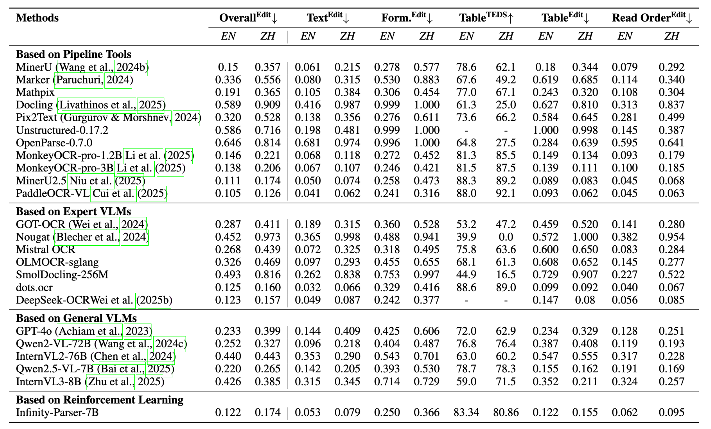
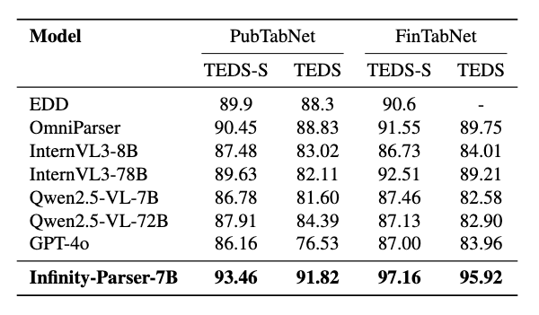
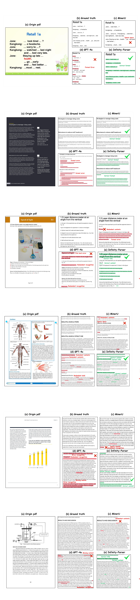

# Infinity Parser: Layout Aware Reinforcement Learning for Scanned Document Parsing

<div align="center">

🤗 <a href="https://huggingface.co/infly/Infinity-Parser-7B">Model</a> |
📊 <a href="https://huggingface.co/datasets/infly/Infinity-Doc-55K">Dataset</a> |
📄 <a href="https://arxiv.org/pdf/2506.03197">Paper</a> |
🚀 <a href="https://huggingface.co/spaces/infly/Infinity-Parser-Demo">Demo</a>

</div>


# Introduction

We develop Infinity-Parser, an end-to-end scanned document parsing model trained with reinforcement learning. By incorporating verifiable rewards based on layout and content, Infinity-Parser maintains the original document's structure and content with high fidelity. Extensive evaluations on benchmarks in cluding OmniDocBench, olmOCR-Bench, PubTabNet, and FinTabNet show that Infinity-Parser consistently achieves state-of-the-art performance across a broad range of document types, languages, and structural complexities, substantially outperforming both specialized document parsing systems and general-purpose vision-language models while preserving the model’s general multimodal understanding capability.

## Key Features

- LayoutRL Framework: a reinforcement learning framework that explicitly trains models to be layout-aware through verifiable multi-aspect rewards combining edit distance, paragraph accuracy, and reading order preservation.

- Infinity-Doc-400K Dataset: a large-scale dataset of 400K scanned documents that integrates high-quality synthetic data with diverse real-world samples, featuring rich layout variations and comprehensive structural annotations.

- Infinity-Parser Model: a VLM-based parser that achieves new state-of-the-art performance on OCR, table and formula extraction, and reading-order detection benchmarks in both English and Chinese, while maintaining nearly the same general multimodal understanding capability as the base model.

# Architecture

Overview of Infinity-Parser training framework. Our model is optimized via reinforcement finetuning with edit distance, layout, and order-based rewards.


# Performance

## olmOCR-bench


## OmniDocBench


## Table Recognition


# Quick Start
### Download Model Weights

```shell
git clone https://github.com/infly-ai/INF-MLLM.git
cd Infinity-Parser
pip install -r requirements.txt

python3 tools/download_model.py
```

### Vllm Inference
We recommend using the vLLM backend for accelerated inference. 
It supports image and PDF inputs, automatically parses the document content, and exports the results in Markdown format to a specified directory.

Before starting, make sure that **PyTorch** is correctly installed according to the official installation guide at [https://pytorch.org/](https://pytorch.org/).

```shell
pip install .

parser --model /path/model --input dir/PDF/Image --output output_folders --batch_size 128 --tp 1
```

Adjust the tensor parallelism (tp) value — 1, 2, or 4 — and the batch size according to the number of GPUs and the available memory.

<details>
  <summary>【The information of result folder】</summary>
The result folder contains the following contents:

```
output_folders/
├── <fime_name>/output.md
├── ...
├── ...
```

</details>


### Using Transformers to Inference

<details>
    <summary> Transformers Inference Example </summary>
    
```python
import torch
from transformers import Qwen2_5_VLForConditionalGeneration, AutoTokenizer, AutoProcessor
from qwen_vl_utils import process_vision_info

model_path = "infly/Infinity-Parser-7B"
prompt = "Please transform the document’s contents into Markdown format."

print("Loading model and processor...")
# Default: Load the model on the available device(s)
# model = Qwen2_5_VLForConditionalGeneration.from_pretrained(
#     model_path, torch_dtype="auto", device_map="auto"
# )

# We recommend enabling flash_attention_2 for better acceleration and memory saving, especially in multi-image and video scenarios.
model = Qwen2_5_VLForConditionalGeneration.from_pretrained(
    model_path,
    torch_dtype=torch.bfloat16,
    attn_implementation="flash_attention_2",
    device_map="auto",
)

# Default processor
# processor = AutoProcessor.from_pretrained(model_path)

# Recommended processor
min_pixels = 256 * 28 * 28   # 448 * 448
max_pixels = 2304 * 28 * 28  # 1344 * 1344
processor = AutoProcessor.from_pretrained(model_path, min_pixels=min_pixels, max_pixels=max_pixels)

print("Preparing messages for inference...")
messages = [
    {
        "role": "user",
        "content": [
            {
                "type": "image",
                "image": "https://ofasys-multimodal-wlcb-3-toshanghai.oss-accelerate.aliyuncs.com/wpf272043/keepme/image/receipt.png",
            },
            {"type": "text", "text": prompt},
        ],
    }
]

text = processor.apply_chat_template(
    messages, tokenize=False, add_generation_prompt=True
)
image_inputs, video_inputs = process_vision_info(messages)
inputs = processor(
    text=[text],
    images=image_inputs,
    videos=video_inputs,
    padding=True,
    return_tensors="pt",
)
inputs = inputs.to("cuda")

print("Generating results...")
generated_ids = model.generate(**inputs, max_new_tokens=4096)
generated_ids_trimmed = [
    out_ids[len(in_ids) :] for in_ids, out_ids in zip(inputs.input_ids, generated_ids)
]
output_text = processor.batch_decode(
    generated_ids_trimmed, skip_special_tokens=True, clean_up_tokenization_spaces=False
)
print(output_text)
```
</details>

# Visualization

## Comparison Examples


# Citation

```
@misc{wang2025infinityparserlayoutaware,
      title={Infinity Parser: Layout Aware Reinforcement Learning for Scanned Document Parsing}, 
      author={Baode Wang and Biao Wu and Weizhen Li and Meng Fang and Zuming Huang and Jun Huang and Haozhe Wang and Yanjie Liang and Ling Chen and Wei Chu and Yuan Qi},
      year={2025},
      eprint={2506.03197},
      archivePrefix={arXiv},
      primaryClass={cs.CV},
      url={https://arxiv.org/abs/2506.03197}, 
}
```

## Limitation & Future Work

### Limitations
 - **Layout / BBox**: The current model does not provide layout or bounding box (bbox) information, which limits its ability to support downstream tasks such as structured document reconstruction or reading order prediction.
 - **Charts & Figures**: The model lacks perception and understanding of charts and figures, and therefore cannot perform visual reasoning or structured extraction for graphical elements.
 
### Future Work

We are dedicated to enabling our model to **read like humans**, and we firmly believe that **Vision-Language Models (VLMs)** can make this vision possible. We have conducted **preliminary explorations of reinforcement learning (RL) for document parsing** and achieved promising initial results.  In future research, we will continue to deepen our efforts in the following directions:

- **Chart & Figure Understanding**: Extend the model’s capability to handle chart detection, semantic interpretation, and structured data extraction from graphical elements.

- **General-Purpose Perception**: Move toward a unified **Vision-Language perception model** that integrates detection, image captioning, OCR, layout analysis, and chart understanding into a single framework.

## Acknowledgments
We would like to thank [Qwen2.5-VL](https://github.com/QwenLM/Qwen2.5-VL), [MinerU](https://github.com/opendatalab/MinerU), [MonkeyOCR](https://github.com/Yuliang-Liu/MonkeyOCR), [EasyR1](https://github.com/hiyouga/EasyR1), [LLaMA-Factory](https://github.com/hiyouga/LLaMA-Factory)
[OmniDocBench](https://github.com/opendatalab/OmniDocBench), [dots.ocr](https://github.com/rednote-hilab/dots.ocr), for providing code and models. 


# License

This model is licensed under apache-2.0.
